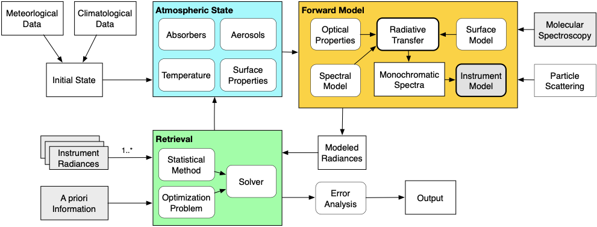

ReFRACtor
=========

Jet Propulsion Laboratory, California Institute of Technology. \
Copyright 2022 California Institute of Technology. \
U.S. Government sponsorship acknowledged.

The Reusable Framework for Retrieval of Atmospheric Composition (ReFRACtor) software transforms radiance data from multiple co-located instruments into physical quantities such as ozone volume mixing ratio using an optimal estimation-based retrieval process. It provides an extensible multiple instrument Earth science atmospheric composition radiative transfer and retrieval software framework that enables software reuse while enabling data fusion.

ReFRACtor is designed to connect components through abstract interfaces that make the fewest possible implementation assumptions. The isolation of details behind abstract interfaces allows the interchange of different component implementations without needing to modify existing tested code. The core framework software repository contains generic algorithms that are reusable by multiple instrument adaptation implementations. Adaptations are located in separate software repositories that contain instrument specific configuration, data and algorithms.

The framework provides a radiative transfer solution that can model radiances from the ultraviolet to thermal spectral regions with multiple scattering and thermal emission capabilities, thereby making it applicable for a wide range of missions. Spectroscopy information is provided by a separate open source tool built for us by Atmospheric and Environmental Research (AER). Multiple well-tested implementations of Non-Linear Least Squared (NLLS) solvers are available that provide different assumptions about the problem state. The retrieval interface separates the definition of the atmospheric retrieval problem and the statistical approach from the solver itself, while allowing for custom cost function implementations.

Retrievals can be performed using a single solver in a global pan-spectral minimization or using a multi-step approach. The multi-step approach chains together multiple solver configurations that minimize different species and spectral regions while keeping the rest of the atmospheric state fixed. This technique allows a retrieval to first minimize broadband effects such as those due to surface reflectance before modifying species amounts in the spectral regions of maximum sensitivity. In each step the NLLS solver used may be different. A posteriori information is fed from one step as the a priori covariance information for the next step.

As shown by the gray boxes in Figure 1, new instrument implementations nominally need to provide only: a radiance data reader, an instrument spectral response function definition, spectral and molecular configuration information, and absorption coefficient tables generated for the instrument spectral regions. Currently, we have interfaces for the Crosstrack Infrared Sounder (CrIS), Ozone Mapping and Profiling Suite (OMPS), OCO-2 and Ozone Monitoring Instrument (OMI) instruments. We are currently in the process of verifying and validating these configurations, and are beginning to extend the software to process Tropospheric Monitoring Instrument (TROPOMI) data .

The core algorithms are written in C++ and Fortran. C++ interface wrappers have been developed for Fortran code in an efficient manner. For example, our default radiative transfer code is written in Fortran 90 but has a C++ layer that exposes the Fortran memory arrays, such that unnecessary copying of data values is not needed hence maintaining performance. On top of the C++ layer, we have a Python layer created using the Simplified Wrapper and Interface Generator (SWIG) tool. The Python layer allows for direct access to the C++ components as if they were Python objects. The passing of array values to and from Python is handled in a way that eliminates copying of values while taking into account issues related to memory lifetime. The Python SWIG interface layer has been used to create a configuration layer that simplifies the connection of framework components together to create runnable systems for instrument adaptations.

The framework also has other unique features. It contains an auto derivative system that allows for easy implementation of Jacobian (derivative of radiance with respect to geophysical or instrument parameters) computations for new components. Jacobians are computed through the use of augmented classes that overload mathematical operations such that the Jacobian values are computed along with radiances. This provides a significant advantage over other codes where Jacobians are hand coded or processed using finite differences. Auto derivatives make the code less prone to implementation errors than hand coded Jacobians and faster than finite difference Jacobian calculations. The software also contains the ability for arrays to have an associated unit attached that can be used for automatic unit conversion operations. Having units attached to data values significantly reduces errors related to assumptions about the units of a software interface.RT Retrieval Framework

The software is a fork of the [RtRetrievalFramework](https://github.com/nasa/RtRetrievalFramework) originally created for JPL's OCO, ACOS and OCO-2 projects for Level-2 processing (NASA NTR-49044).

Documentation
-------------

Documentation on setup and compiling of the software can be found at:
[here](https://github.jpl.nasa.gov/pages/refractor/documentation/)

Doxgyen documentation is available at
[here](https://github.jpl.nasa.gov/pages/refractor/framework/)
